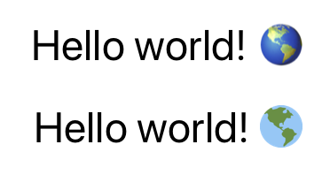

# 😁 react-native-twemojis 📦

[](https://www.npmjs.com/package/react-native-twemojis)


Replace emojis with Twemojis in your next React Native app.

## 📥 Installation

`npm install react-native-twemojis`

or

`yarn add react-native-twemojis`

## 👀 Demo

At the top there is `Text` component rendered on iOS device, and at the bottom there is rendered `TwemojiText` component.



## 🧰 Usage

The `TwemojiText` component behaves just like `Text` component, but replaces all the emojis with their Twemoji equivalent.

```
import TwemojiText from 'react-native-twemojis';

const Component = () => {
    return (
        <TwemojiText>
            Hello world! 🌎
        </TwemojiText>
    );
}
```

The `TwemojiText` component accepts all `Text` props by default. If you want to customize the styling of the Twemojis there is a `twemojiStyle` prop which accepts `Image` styling.